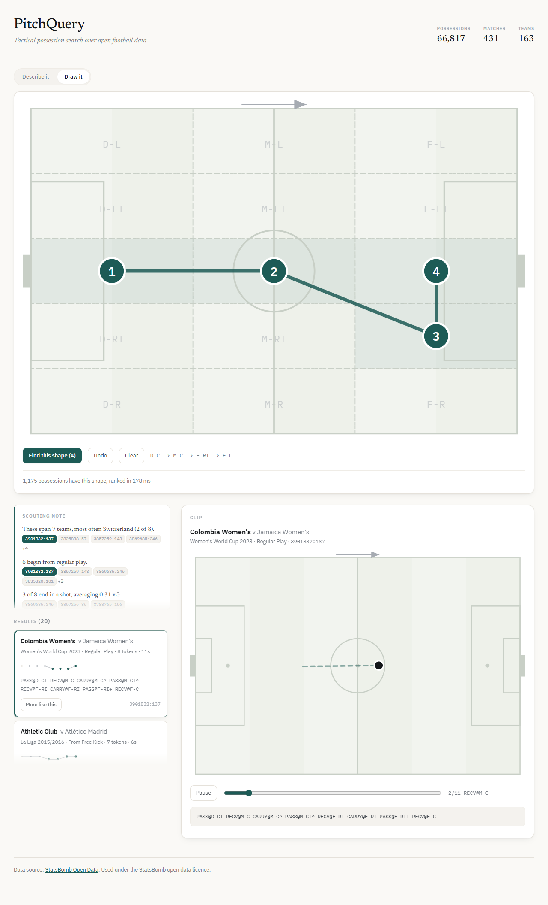

# PitchQuery

**Search 66,817 football possessions by what happened in them.** Describe a
passage of play in English — or draw its shape on a pitch — and get back ranked,
animated clips, with a scouting note whose every claim links to the clips it was
computed from.

Live Link: **[pitch-query.vercel.app](https://pitch-query.vercel.app)** 

Backend Deployed on: [API](https://pitchquery-api.onrender.com/health)

> The hosted API sleeps after 15 minutes idle and takes ~50 s to wake. Open
> [`/health`](https://pitchquery-api.onrender.com/health) first if you want it
> warm.

## Video Demo

https://github.com/user-attachments/assets/4093f1bf-9ba3-45d4-9c56-5f92ef6957ea


---

## The problem

Event data describes football as a list of rows: a pass here, a carry there,
coordinates and timestamps. Analysts do not think in rows. They think in
passages — *"a cross from the right that ends in a shot"*, *"playing out from
the back under pressure"* — and there is no way to query for one.

PitchQuery makes the passage the unit of retrieval. Each of the 66,817
possessions in the corpus is compressed into a single line of a controlled
grammar:

```
SETP@F-R> RECV@F-C SHOT@F-C^                       a corner, headed at goal under pressure
RECOV@M-C CARRY@M-C+ PASS@F-LI+ RECV@F-C SHOT@F-C  a counter-attack
```

`ACTION@ZONE` over a 3x5 grid, with `+` progressive, `>` into the box, `^` under
pressure. That string is what gets indexed, ranked and searched.

---

## Results

| | | how it was measured |
|---|---|---|
| **Retrieval** | P@5 **0.608**, MRR 0.751, p50 36 ms / p95 123 ms | 30 queries, relevance from per-query rubrics written *before* any results were seen; **87% agreement** with a human on a blind 71-item audit |
| **xG model** | closes **76%** of the log-loss gap to StatsBomb's production model, and is live in the demo | held out the 2022 World Cup and 2023 Women's World Cup entirely; split by competition, never by shot |
| **Query parsing** | **1 ms**, no LLM, no API key | 24/30 filter agreement with hand-written queries, and it holds on a held-out paraphrase set |
| **Learned ranker** | NDCG@10 **0.540** against **0.407** for fixed reciprocal rank fusion | leave-one-query-out over 30 queries — a real gain whose 95% interval (±0.090) barely excludes zero, so read it as a direction, not a measurement |
| **Metric gate** | a pull request that makes retrieval worse **cannot be merged** | GitHub Actions loads a committed 40k-possession fixture, reruns both evals and posts old/new/delta as a PR comment |

Full write-ups: [retrieval](docs/retrieval_eval.md) ·
[xG benchmark](docs/benchmark.md) · [learned ranker](docs/ranker_eval.md) ·
[planner](docs/planner_eval.md) · [drift](docs/drift/) · [data](docs/ingest.md)

---

## How it works


Hard filters run in SQL first and ranking happens second — never the reverse.
Ranking the whole corpus and filtering afterwards means a query for one team's
corners comes back with another team's open play once the filter eats the top
results.

---

## Four decisions worth explaining

### The dense ranker was supposed to lose. It didn't.

The premise was that TF-IDF over a controlled vocabulary would beat sentence
embeddings, and that dense retrieval would earn its place only in fusion. Half
right:

| ranker | P@5 | P@10 | MRR |
|---|--:|--:|--:|
| sparse (TF-IDF n-grams) | 0.544 | **0.540** | **0.671** |
| dense (MiniLM + pgvector) | **0.584** | 0.516 | 0.638 |
| **fused (RRF)** | **0.608** | **0.600** | **0.751** |

Sparse ranks its best hit higher; dense wins on P@5. They agree on only **1 of
their top 10** results for a typical query — which is exactly why fusing them
works. Where dense fails is specific: asked for a right-wing cross it returned
`CROSS@F-L>`, a *left*-wing cross, because MiniLM sees `F-L` and `F-R` as one
character apart and has no idea one means left.

### The English layer is rules, not a language model.

A parser turns *"Barcelona working the ball into the left half-space"* into
structured filters plus a synthetic token string. It runs in **1 ms**, needs no
key, and is deterministic — so a retrieval regression is never the planner's
fault. Crucially, it shows its work: the UI displays which phrase produced which
filter, and **which words it failed to understand**.

Measured against the same 30 queries written by hand, it scores **0.611 vs
0.632** P@5 on the subset where both produce identical filters — and it holds up
on paraphrases it was never tuned against. An LLM would generalise further; this
trades that for being free, instant and inspectable.

### Citations that cannot be wrong.

The scouting note's sentences are *computed from* the possessions they cite —
claim and evidence are the same expression, so there is no verification step
because there is nothing that can lie:

```python
goals = [r for r in rows if r["ended_in_goal"]]
Claim(f"{len(goals)} of the {n} are scored", uids=[r["possession_uid"] for r in goals])
```

`tests/test_notes.py` enforces it, and caught a real violation while being
written: a sentence counting goals was citing every shot.

### The xG model is deployed as arithmetic, not as a pickle.

Every result carries this model's xG rather than StatsBomb's — including the
scouting note, so the prose and the badges beside it quote the same model. The
clip panel scores the final shot specifically, then lists the earlier attempts
and the total: one shot-ending possession in ten contains a rebound, and there
the possession total is nobody's chance in particular.

StatsBomb's figure appears only as a stated gap, never a second bar. Two bars
invite a verdict from one shot, and one shot settles nothing — a 0.15 chance
that goes in is not evidence against 0.15. The verdict is in the
[benchmark](docs/benchmark.md), over thousands.

Training produces a `CalibratedClassifierCV` around three LightGBM boosters.
Shipping that pickle would mean pinning scikit-learn and pandas on the server to
whatever a laptop happened to have. So it is re-serialised into what it actually
is — three ensembles in LightGBM's own text format, a two-parameter sigmoid on
each — and the whole thing is **599 KB gzipped, committed to the repo, and
scored with numpy**. Serving it costs 7 MB of resident memory.

The translation is hand-written, so `tests/test_xg_portable.py` scores all
10,858 non-penalty shots both ways and requires exact equality. It earns its
place: scikit-learn calibrates lightgbm's *raw margin*, not its probability, and
calibrating the probability instead returns values wedged between 0.43 and 0.62
— all of which look like believable xG on a page while being wrong on every
shot.

---

## Draw a possession instead of describing one



Click zones on the pitch and get back moves that took that journey. No text, no
vectors, no model — the query is matched against the `zone_path` every
possession already carries, in ~30 ms across all 66,817.

Ranking is by **coverage**: what fraction of a possession's whole journey the
drawing accounts for, after collapsing consecutive repeats. Ranking by how
tightly the drawn zones cluster was tried first and was wrong — it surfaced
100-touch possessions where three zones happened to line up somewhere in the
middle, which is incidental rather than the shape of the move.

---

## Limitations

**Short possessions are over-retrieved.** TF-IDF vectors are L2-normalised, so a
3-token possession whose every token matches scores near-perfectly, while a
20-token possession containing the same passage *plus* the build-up that led to
it is diluted. Across the top 5 for all 30 parsed queries the median possession
is 6 tokens against a corpus median of 13.

This inflates the headline P@5, because most rubrics test for the presence of
tokens rather than for the possession being a substantial passage of play. **The
sparse and fused numbers above should be read as an upper bound.** The learned
ranker is the fix — `n_tokens / corpus_median` is one of its features precisely
so that fusion can express "too short to be the move that was asked for" — but
30 training queries is not enough to call it solved, and
[`docs/ranker_eval.md`](docs/ranker_eval.md) says so in as many words. Shape
search is unaffected; it never uses cosine similarity.

**The eval set is 30 queries, and that is the binding constraint on the ranker** —
not the model and not the features. `search_log` and `click_log` exist to grow it
out of real use: a result someone opens at rank 5 or below is a ranking that was
wrong, and `python -m pipeline.telemetry --write` collects exactly those into
`eval/candidates.json` for hand-grading. Nothing reaches the eval set
automatically. A rubric is a judgement, and an eval set generated from the
ranker's own output agrees with it by construction.

**The parser only knows the vocabulary written into it.** No alias table, so
"PSG" is not a team. That case sits in the evaluation set as a deliberate
failure rather than being quietly dropped.

**"Outside the box" is unanswerable** on a 15-zone grid: `F-C` spans both the
box and the space in front of it. A structural limit of the grid design,
documented rather than hidden.

**The hosted demo runs sparse-only.** torch is ~2.5 GB installed and takes
resident memory from 252 MB to 570 MB, past the free tier's 512 MB. `/health`
reports `"rankers": "sparse only"` rather than implying it is still fusing. The
xG model is unaffected and does run there — 599 KB and 7 MB resident — and so
does the learned reranker, at 38 KB.

**The match replay is a replay.** StatsBomb publish open data long after the
match. `stream/producer.py` reads a cached file and sleeps the real gaps between
events; nothing here is a live feed, every WebSocket message carries
`source: "replay"`, and the UI panel is headed "Match replay". The pipeline
underneath — possession state rebuilt incrementally, xG scored the moment a shot
lands — is worth the same without the claim, and claiming live when it is not is
the fastest way to lose the room.

**CI measures a fixture, not the corpus.** Every number in a PR comment comes
from `eval/fixtures/corpus.sql.gz`, a committed 40,000-possession sample whose
relevant rows are chosen by the rubrics rather than by the ranker. That size was
measured, not guessed: the first two attempts — 2,000 rows, then 10,000 —
produced a gate that *passed* a ranker with the zone information deleted out of
every token. `eval/fixtures/make_fixture.py` records what each attempt missed.

---

## Running it

```powershell
python -m venv .venv; .\.venv\Scripts\Activate.ps1
pip install -r requirements.txt
copy .env.example .env

docker compose up -d db                  # Postgres 16 + pgvector on :5433
python ingest/02_fetch.py --comp 43:106 --comp 72:107   # see docs/ingest.md
python ingest/03_load_events.py --init
python ingest/04_build_possessions.py
python ingest/05_embed.py

uvicorn api.main:app --port 8000
cd web; npm install; npm run dev         # http://localhost:3000
```

Reproduce the numbers:

```powershell
pip install -r requirements-ml.txt
python eval/score_retrieval.py    # -> docs/retrieval_eval.md
python eval/score_planner.py      # -> docs/planner_eval.md
python models/train_xg.py; python models/evaluate_xg.py
python models/train_ranker.py     # -> docs/ranker_eval.md
python -m pytest tests/ -q
```

### The platform layer

Orchestration, the warehouse, tracking, monitoring, the replay and the
dashboard. All local, all the open-source edition — the paid products with the
same names (Prefect Cloud, dbt Cloud, Evidently Cloud, Grafana Cloud) are not
used anywhere and are not needed for any of it.

```powershell
pip install -r requirements-pipeline.txt

# Phases 1-4 — the whole ingest as one flow: retries, an incremental watermark,
# dbt models and tests between the Python steps, Pandera contracts on every
# batch before it is written.
prefect server start                        # terminal 1, UI on :4200
python -m pipeline.flows                    # terminal 2
python -m pipeline.flows --comp 43:106      # or one competition

cd warehouse; dbt deps; dbt build --profiles-dir .    # models and tests together
dbt docs generate --profiles-dir .; dbt docs serve --profiles-dir .

# Phase 5 — every run tracked; `champion` moves only on a better held-out
# log-loss, and a losing run's artefacts are rolled back to the champion's.
mlflow server --backend-store-uri sqlite:///mlflow.db --default-artifact-root ./mlruns

# Phases 9-10 — drift reports and serving metrics.
python monitoring/drift_report.py --split gender
docker compose --profile obs up -d          # Grafana on :3001, admin/admin

# Phase 11 — replay a recorded match through Kafka. Not a live feed.
docker compose --profile stream up -d
$env:PITCHQUERY_STREAM=1; uvicorn api.main:app --port 8000
python stream/producer.py --match 3869685 --speed 60

# Phase 12 — the operational dashboard.
streamlit run dashboard/app.py

# Phase 8 — turn the query log into an eval backlog.
python -m pipeline.flows --nightly          # drift + candidates, as one flow
```

The metric gate runs on every pull request
([`.github/workflows/eval.yml`](.github/workflows/eval.yml)): it loads the
fixture corpus into a service container, reruns both eval scripts and
`ci/compare_metrics.py`, and posts old/new/delta as a PR comment. A P@5 drop over
0.02, or an xG log-loss rise over 0.005, fails the job. To move a baseline
deliberately: `python eval/report.py retrieval xg`.

`deploy/export_to_neon.py` ships a slim copy to hosted Postgres: dropping the
raw JSONB, embeddings and tsvector takes 3.7 GB down to **424 MB**, which is why
the live demo carries the entire corpus rather than a subset.

---

## Stack

Python · PostgreSQL 16 + pgvector · scikit-learn · LightGBM ·
sentence-transformers · FastAPI · Next.js · Docker ·
Prefect · dbt · Pandera · MLflow · Evidently · Prometheus + Grafana ·
Redpanda · Streamlit · GitHub Actions ·
deployed on Vercel + Render + Neon

**Orchestration, tracking and monitoring run locally via Docker profiles; only
the API and the web app are hosted.** That is a decision rather than a gap: the
free tier gives 512 MB and the API already uses 252 MB of it, so a metrics
scraper or a broker living beside it would be paid for out of the product's
memory. `docker compose up -d db` still starts exactly one container; everything
else is behind `--profile obs` or `--profile stream`.

Two things this deliberately does **not** have. A **feature store** would solve a
problem that does not exist here — `core/features.py` and
`core/rank_features.py` are imported by both the trainers and the API, which is
the same no-skew guarantee in fifty lines and without a second source of truth to
keep in step. And **DVC**: every metrics file carries a corpus fingerprint (row
count plus an MD5 of the sorted possession uids) written by `eval/report.py`, so
two numbers measured on different data are detected and reported as incomparable
instead of being compared. Reproducibility without a second version-control
system.

**Data source: [StatsBomb Open Data](https://github.com/statsbomb/open-data)**,
used under their open-data licence. StatsBomb is credited here, in the app
footer, and on every exported chart.
