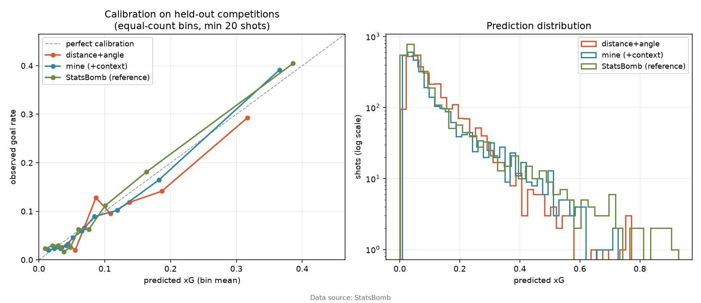

# xG benchmark

**My model closes 76% of the log-loss gap** between a distance+angle baseline and StatsBomb's production model, on competitions neither model was trained on here.

Held out: **43:106, 72:107** (3,038 shots). Trained on 7,820 shots across 11 other competition/seasons: 11:27, 11:90, 2:27, 44:107, 53:106, 53:315, 55:282, 55:43, 7:108, 7:235, 9:281.

Split by competition/season, never by shot — shots inside a match share a game state and a shooter, so a random shot split leaks between train and test and inflates every number below. Penalties are excluded (fixed geometry, ~78% conversion, and they flatter AUC badly). `statsbomb_xg` is a comparison column only and is never a feature.

Data source: StatsBomb.

| model | log-loss | Brier | ROC-AUC | expected goals | observed | O/E | gap closed |
|---|--:|--:|--:|--:|--:|--:|--:|
| distance+angle | 0.2811 | 0.0786 | 0.7330 | 322.4 | 288 | 0.893 | 0% |
| mine (+context) | 0.2581 | 0.0727 | 0.7933 | 297.8 | 288 | 0.967 | **76%** |
| StatsBomb (reference) | 0.2507 | 0.0693 | 0.8035 | 282.8 | 288 | 1.018 | 100% |

## By competition

| competition/season | shots | goals | baseline | mine | StatsBomb |
|---|--:|--:|--:|--:|--:|
| 43:106 | 1,430 | 152 | 0.2972 | 0.2728 | 0.2665 |
| 72:107 | 1,608 | 136 | 0.2669 | 0.2450 | 0.2367 |
